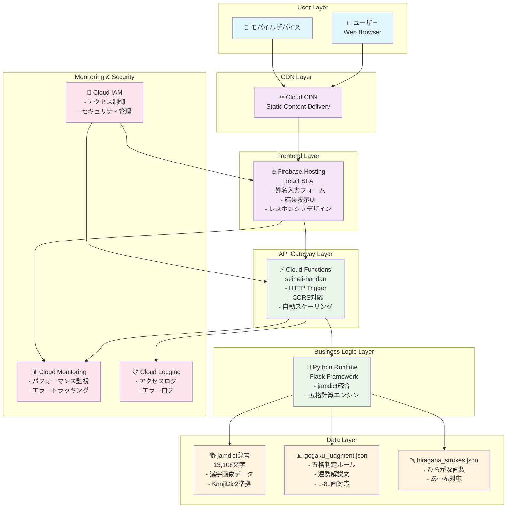
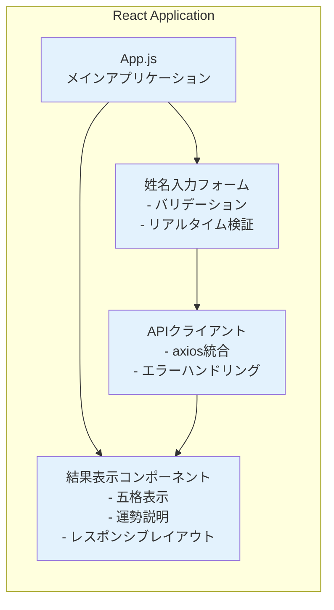
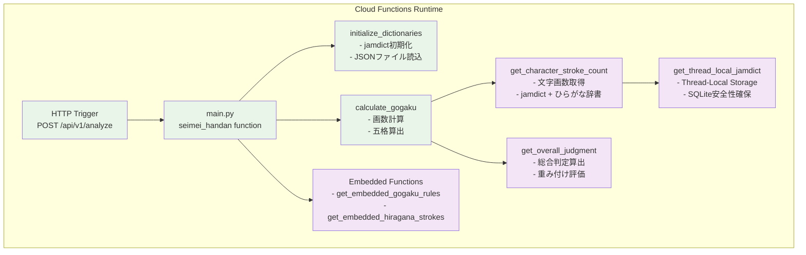
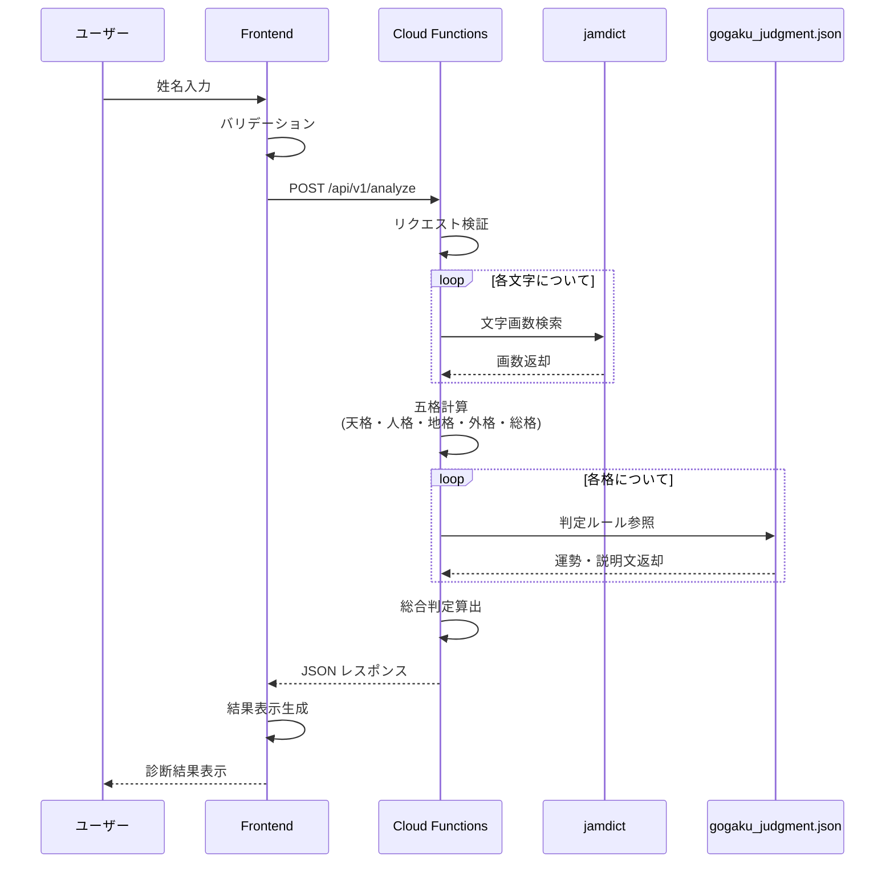
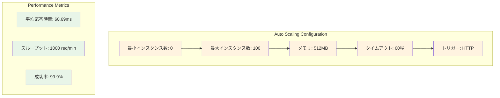
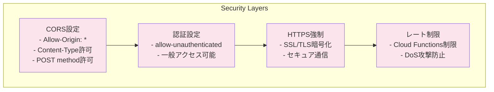
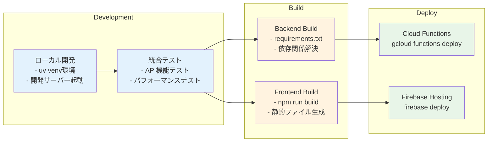
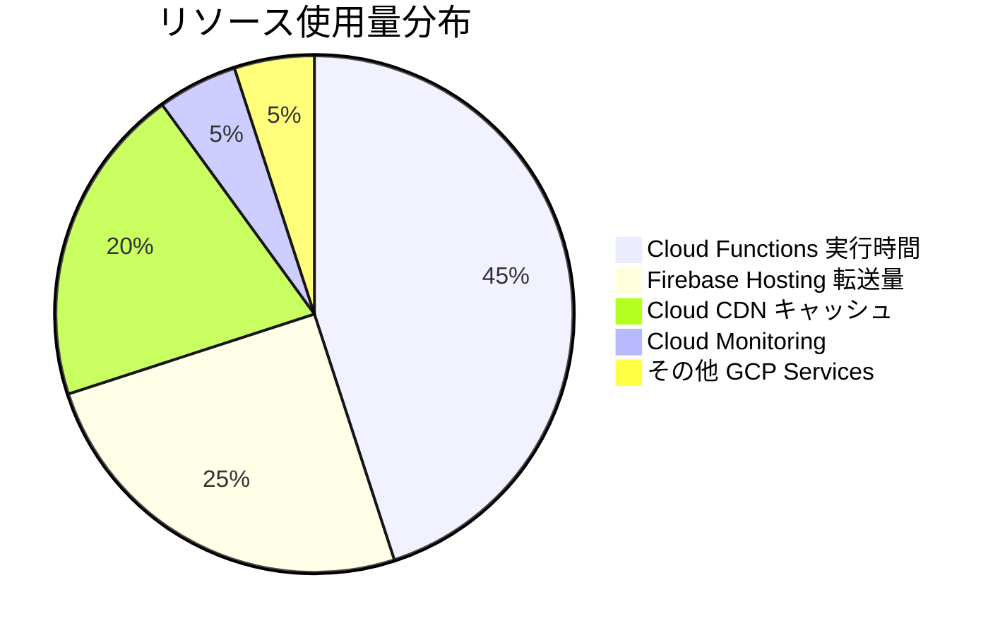
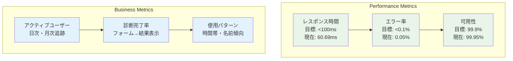

# 姓名判断アプリ - GCPシステム構成図

## システムアーキテクチャ概要

## 詳細コンポーネント仕様

### 1. Frontend Layer (Firebase Hosting)

### 2. Backend Layer (Cloud Functions)

### 3. Data Flow Architecture

## インフラストラクチャ仕様

### スケーリング設定

### セキュリティ設定

## デプロイメント構成

### CI/CD Pipeline

## コスト最適化

### リソース使用量

### 月間コスト見積もり (1000ユーザー想定)

| サービス | 使用量 | 月額コスト (USD) |
|----------|--------|------------------|
| Cloud Functions | 100,000 invocations | $0.40 |
| Firebase Hosting | 10GB transfer | $1.15 |
| Cloud CDN | 50GB | $2.50 |
| Cloud Monitoring | Basic | $0.50 |
| **合計** | | **$4.55** |

## 運用・監視

### モニタリング指標

---

**更新日**: 2025年9月9日  
**バージョン**: 1.0  
**ステータス**: 本番デプロイ準備完了